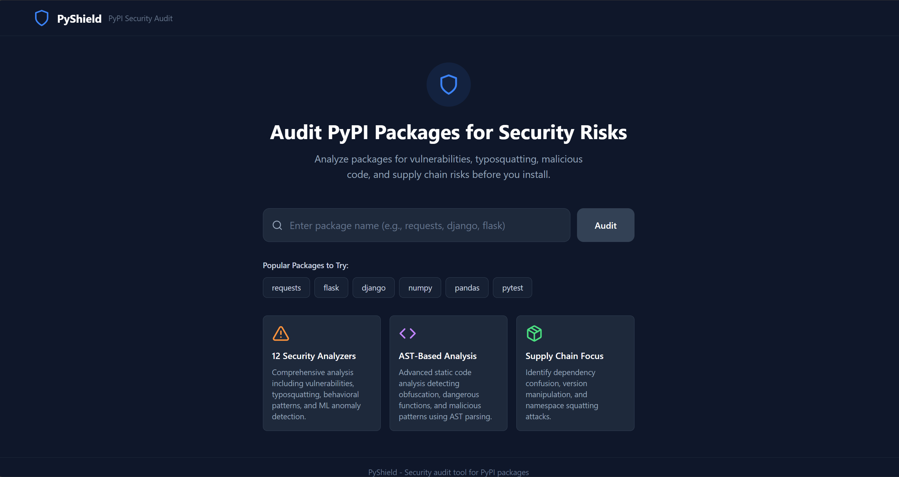
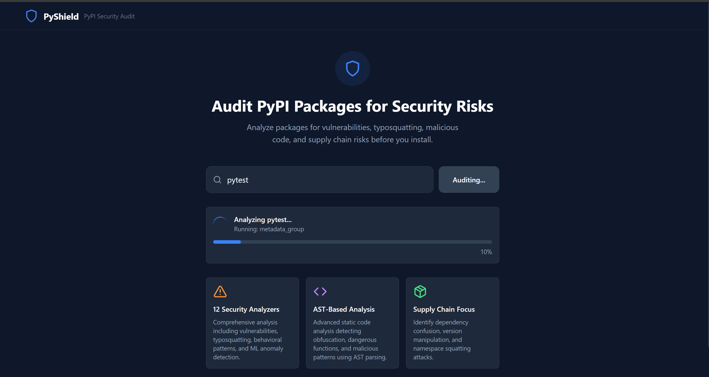
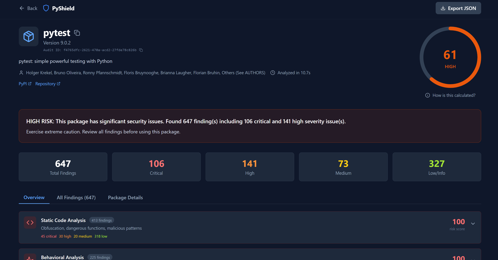
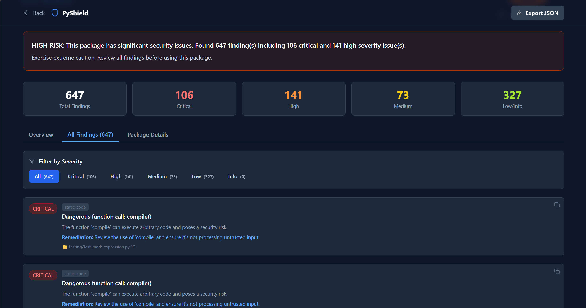
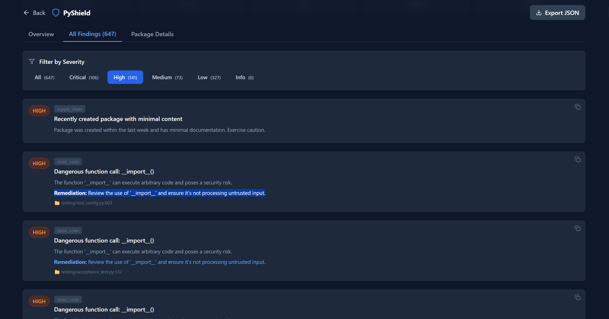
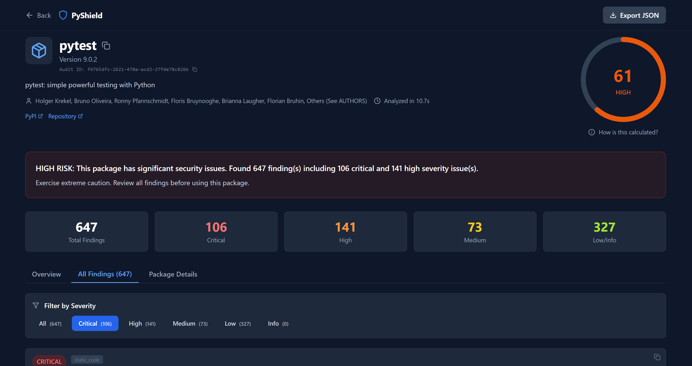
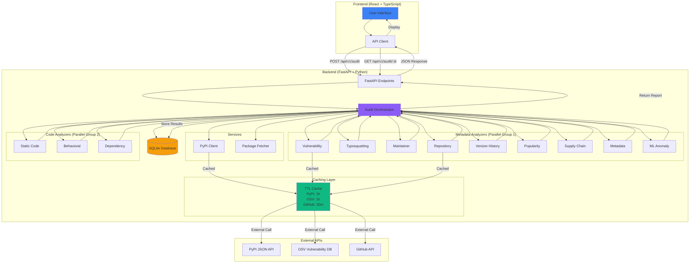

# PyShield - PyPI Package Security Audit Tool

**A comprehensive security audit tool for PyPI packages** that provides enterprise-grade security analysis through 12 specialized analyzers, detecting vulnerabilities, typosquatting, malicious code patterns, and supply chain risks.

## 🚀 Key Features

- **12 Security Analyzers** - Most comprehensive analysis available (vulnerability, typosquatting, static code, behavioral, supply chain, and more)
- **Powerful CLI** - Command-line interface with fast mode (3-5s), multiple output formats, and CI/CD integration
- **Pre-commit Hooks** - 3 built-in hooks (format-check, typo-check, package-check) for instant security feedback
- **Real-time Analysis** - Live progress tracking with detailed status updates
- **AST-Based Detection** - Advanced static analysis using Python's AST, not just regex
- **Entropy Analysis** - Detects obfuscated payloads using Shannon entropy calculations
- **OSV Integration** - Real-time vulnerability data from Google's OSV database
- **SBOM Generation** - Export CycloneDX 1.6 format for compliance (CISA, EU Cyber Resilience Act)
- **Export Capabilities** - Download reports as JSON or SBOM for CI/CD integration
- **Database Persistence** - All audits stored with SQLite for audit trails
- **Rate Limiting** - Production-ready with 10 audits/hour/IP protection
- **200+ Tests** - Comprehensive test suite with 93-97% coverage on critical analyzers

## 🎯 Why PyShield?

**Most Comprehensive Analysis**
- **12 specialized analyzers** vs typical 3-4 in other tools
- Detects both **known vulnerabilities** (CVEs) and **unknown threats** (malicious patterns)
- Analyzes **behavior, metadata, supply chain, and code** in one tool

**Advanced Detection Techniques**
- **AST parsing** for precise code analysis (not just regex pattern matching)
- **Shannon entropy calculation** to detect obfuscated/encrypted payloads
- **Behavioral analysis** catches import hooks, module injection, builtins modification
- **ML anomaly detection** identifies statistically suspicious packages

**Production-Ready**
- **Real-time progress tracking** with live updates during analysis
- **Database persistence** - all audits stored for compliance and audit trails
- **Rate limiting** and **security headers** for safe deployment
- **SBOM generation** for regulatory compliance (CISA, EU regulations)
- **Comprehensive test suite** (200+ tests, 93-97% coverage on critical components)

**Developer-Friendly**
- **Modern tech stack**: FastAPI + React + TypeScript + Docker
- **Powerful CLI** with fast mode (3-5s scans), multiple output formats (text/json/compact)
- **Export to JSON/SBOM** for CI/CD integration
- **Interactive API docs** at `/docs` (Swagger UI)
- **CI/CD ready** with exit codes, thresholds, and pipeline examples
- **Clear documentation** with examples and troubleshooting
- **Easy deployment** with Docker Compose or pip install

## Screenshots

### Homepage

*Search for any PyPI package with intelligent suggestions*

### Analysis Progress

*Real-time progress tracking during security analysis*

### Report Overview

*Comprehensive risk assessment with visual risk gauge*

### Category Breakdown

*Detailed analysis across 12 security categories*

### Finding Details

*Actionable findings with severity levels and remediation guidance*

### Severity Filters

*Filter findings by severity with live count badges*

> **Note:** To capture screenshots for your local setup, see instructions in [docs/screenshots/README.md](docs/screenshots/README.md)

## Features

### Security Analysis Categories

**Core Analyzers:**

1. **Vulnerability Analysis** - Checks against OSV database for known CVEs and security advisories
2. **Static Code Analysis** - Detects obfuscation, dangerous functions, and malicious patterns:
   - Base64/zlib/marshal obfuscation detection
   - Dangerous function calls (eval, exec, compile)
   - High-entropy string detection
   - Network operations in setup.py
   - Suspicious imports
3. **Typosquatting Detection** - Identifies packages with names similar to popular packages:
   - Levenshtein distance analysis
   - Keyboard typo detection
   - Character substitution attacks
   - Homoglyph detection
4. **Supply Chain Analysis** - Detects dependency confusion and namespace squatting:
   - Internal namespace pattern matching
   - Suspicious version numbers (99.x.x patterns)
   - Single-maintainer risk
5. **Maintainer Analysis** - Evaluates maintainer trust signals and email validation
6. **Metadata Analysis** - Checks for yanked versions, license issues, URL validation
7. **Dependency Analysis** - Analyzes dependency health and abandonment
8. **Repository Analysis** - Validates source repository (GitHub) with stars/forks/activity metrics

**Advanced Analyzers:**

9. **Version History Analysis** - Detects suspicious release patterns:
   - Large version jumps (dependency confusion indicators)
   - Rapid release bursts (5+ versions in 24 hours)
   - Yanked version patterns
   - Version/age inconsistencies
10. **Behavioral Analysis** - Identifies dangerous runtime behaviors:
    - Import hook installation (sys.meta_path, sys.path_hooks)
    - Module injection (sys.modules manipulation)
    - Builtins modification
    - Module-level code execution (exec/eval at import time)
    - Background thread/process spawning
11. **Popularity Analysis** - Analyzes community engagement:
    - GitHub stars, forks, and activity
    - Repository inactivity vs recent PyPI releases
    - Download statistics
    - Community validation metrics
12. **ML Anomaly Detection** - Statistical anomaly detection:
    - Package name entropy analysis
    - Metadata completeness scoring
    - Suspicious feature combinations
    - Deviation from typical package patterns

### Risk Scoring

- Overall risk score (0-100) with weighted category scores
- Risk levels: Critical, High, Medium, Low, Safe
- Detailed findings with severity ratings and remediation advice

### Export Functionality

**Export as JSON**
- Download complete audit reports in JSON format for:
  - Automated security scanning
  - Custom analysis and reporting
  - Long-term audit tracking
  - Integration with your security tools
- **File format**: `pyshield-{package_name}-{version}.json`
- **Includes**: Full report with all findings, scores, metadata, and timestamps

**Using Exported JSON Data**

```python
# Example: Parse PyShield JSON export
import json

with open('pyshield-requests-2.31.0.json') as f:
    report = json.load(f)

print(f"Package: {report['package_name']} v{report['package_version']}")
print(f"Risk Score: {report['overall_risk_score']}/100")
print(f"Risk Level: {report['risk_level']}")

# Check for critical vulnerabilities
vulnerabilities = report['categories']['Vulnerability Analysis']
if vulnerabilities['score'] > 80:
    print("⚠️ Critical vulnerabilities found!")
    for finding in vulnerabilities['findings']:
        if finding['severity'] == 'critical':
            print(f"  - {finding['title']}")

# Extract all high-severity findings
high_severity_findings = [
    finding for category in report['categories'].values()
    for finding in category['findings']
    if finding['severity'] in ['critical', 'high']
]

print(f"\nTotal high-severity findings: {len(high_severity_findings)}")
```

**Export as SBOM (CycloneDX)**
- Download Software Bill of Materials in CycloneDX 1.6 format
- Industry-standard format for compliance and reporting
- **File format**: `pyshield-sbom-{package_name}-{version}.cdx.json`
- **Compatible with**: DependencyTrack, OWASP tools, and other SBOM management platforms
- **Includes**: Components, dependencies, vulnerabilities (VEX), external references
- **Use cases:**
  - Compliance with CISA, EU Cyber Resilience Act, and other regulations
  - Supply chain security management and transparency
  - Vulnerability tracking across projects and dependencies
  - Integration with enterprise security and compliance tools
  - Software composition analysis (SCA)

**Using SBOM Exports**

Import SBOM files into tools like DependencyTrack, or parse programmatically:

```python
# Example: Parse PyShield SBOM export
import json

with open('pyshield-sbom-requests-2.31.0.cdx.json') as f:
    sbom = json.load(f)

print(f"SBOM Format: {sbom['bomFormat']}")
print(f"Spec Version: {sbom['specVersion']}")
print(f"Serial Number: {sbom['serialNumber']}")

# Extract main component (the package)
main_component = sbom['metadata']['component']
print(f"\nPackage: {main_component['name']}@{main_component['version']}")
print(f"PURL: {main_component['purl']}")

# List dependencies
components = sbom.get('components', [])
print(f"\nDependencies: {len(components)}")
for comp in components[:5]:  # Show first 5
    print(f"  - {comp['name']} ({comp.get('version', 'unspecified')})")

# Check for vulnerabilities (VEX)
vulnerabilities = sbom.get('vulnerabilities', [])
print(f"\nVulnerabilities: {len(vulnerabilities)}")
for vuln in vulnerabilities:
    ratings = vuln.get('ratings', [{}])
    severity = ratings[0].get('severity', 'unknown') if ratings else 'unknown'
    print(f"  - {vuln['id']}: {severity.upper()}")
```

**SBOM Integration Examples:**

```bash
# Import into DependencyTrack
curl -X "POST" "http://dependencytrack/api/v1/bom" \
  -H "Content-Type: multipart/form-data" \
  -H "X-Api-Key: ${API_KEY}" \
  -F "project=${PROJECT_UUID}" \
  -F "bom=@pyshield-sbom-requests-2.31.0.cdx.json"

# Validate SBOM with CycloneDX CLI
cyclonedx validate --input-file pyshield-sbom-requests-2.31.0.cdx.json

# Convert to SPDX format (using external tools)
cyclonedx-cli convert \
  --input-file pyshield-sbom-requests-2.31.0.cdx.json \
  --output-file sbom.spdx.json \
  --output-format spdx_json
```

## Quick Start

### Using Docker (Recommended)

```bash
# Clone and navigate to the project
cd round_2

# Build and run
docker-compose up --build

# Access at http://localhost:8000
```

### Manual Setup

**Backend:**
```bash
cd backend
pip install -r requirements.txt
uvicorn app.main:app --reload
```

**Frontend:**
```bash
cd frontend
npm install
npm run dev
```

Access the frontend at `http://localhost:3000` (proxies API to backend)

## CLI Usage

PyShield includes a powerful command-line interface for security scanning directly from your terminal.

### Installation

```bash
# Navigate to backend directory
cd backend

# Install PyShield CLI
pip install -e .

# Verify installation
pyshield --version
```

### Basic Usage

```bash
# Scan a package (latest version)
pyshield scan requests

# Scan a specific version
pyshield scan django --version 3.2.0

# Fast mode (metadata-only, 3-5 seconds)
pyshield scan flask --fast

# JSON output for CI/CD integration
pyshield scan numpy --format json

# Set severity threshold
pyshield scan pandas --threshold critical
```

### Command Options

```
pyshield scan [OPTIONS] PACKAGE_NAME

Arguments:
  PACKAGE_NAME          Name of the PyPI package to scan (required)

Options:
  --version TEXT        Package version to scan (default: latest)
  --fast                Fast mode: metadata-only scan (3-5s, skips code analysis)
  --format [text|json|compact]
                        Output format (default: text)
  --threshold [critical|high|medium|low]
                        Minimum severity to fail (default: high)
  --no-color            Disable colored output
  --config PATH         Path to configuration file (.pyshieldrc)
  --help                Show help message
```

### Output Formats

**Text Format (Default)**
- Rich colored output with visual indicators
- Progress bars during analysis
- Detailed findings with severity badges
- Risk score gauge
- Summary statistics

```bash
pyshield scan requests
```

**JSON Format**
- Machine-readable output
- Perfect for CI/CD pipelines
- Includes all findings and metadata
- Exit code based on threshold

```bash
pyshield scan requests --format json > report.json
```

**Compact Format**
- Minimal output for quick scans
- Shows only risk score and critical findings
- Ideal for pre-commit hooks

```bash
pyshield scan requests --format compact
```

### Fast Mode

Fast mode runs **metadata-only analysis** (3-5 seconds) by skipping package download and code analysis:

```bash
pyshield scan django --fast
```

**What Fast Mode Includes:**
- ✅ Vulnerability Analysis (OSV database)
- ✅ Typosquatting Detection
- ✅ Maintainer Analysis
- ✅ Repository Analysis
- ✅ Version History Analysis
- ✅ Popularity Analysis
- ✅ Supply Chain Analysis
- ✅ Metadata Analysis
- ✅ ML Anomaly Detection

**What Fast Mode Skips:**
- ❌ Static Code Analysis
- ❌ Behavioral Analysis
- ❌ Dependency Analysis (requires package download)

**Use Cases:**
- Pre-commit hooks (instant feedback)
- Quick package screening
- CI/CD pipelines with time constraints
- Rapid bulk scanning

### Exit Codes

PyShield uses standard exit codes for CI/CD integration:

| Exit Code | Meaning | Description |
|-----------|---------|-------------|
| `0` | Success | No findings above threshold |
| `1` | Failure | Findings exceed severity threshold |
| `2` | Error | Execution error (network, invalid package, etc.) |

### Severity Thresholds

Control when the CLI should fail using the `--threshold` option:

```bash
# Fail only on CRITICAL findings
pyshield scan package --threshold critical

# Fail on HIGH or CRITICAL findings (default)
pyshield scan package --threshold high

# Fail on MEDIUM, HIGH, or CRITICAL findings
pyshield scan package --threshold medium

# Fail on any findings (LOW and above)
pyshield scan package --threshold low
```

### CI/CD Integration Examples

**GitHub Actions**

```yaml
- name: Security Scan with PyShield
  run: |
    pip install -e backend/
    pyshield scan ${{ matrix.package }} --format json --threshold high
  continue-on-error: false
```

**GitLab CI**

```yaml
security_scan:
  script:
    - pip install -e backend/
    - pyshield scan ${PACKAGE_NAME} --format json --threshold high
  artifacts:
    reports:
      sast: report.json
```

**Pre-commit Hook**

```yaml
# .pre-commit-config.yaml
repos:
  - repo: local
    hooks:
      - id: pyshield-scan
        name: PyShield Security Scan
        entry: pyshield scan
        language: system
        args: ['--fast', '--threshold', 'high', '--format', 'compact']
        pass_filenames: false
```

**Jenkins Pipeline**

```groovy
stage('Security Scan') {
    steps {
        sh 'pip install -e backend/'
        sh 'pyshield scan requests --format json --threshold high'
    }
}
```

### Advanced Usage

**Scanning Multiple Packages**

```bash
# Bash loop
for package in requests flask django; do
    echo "Scanning $package..."
    pyshield scan $package --fast --format compact
done

# From requirements.txt
cat requirements.txt | cut -d'=' -f1 | while read package; do
    pyshield scan $package --fast
done
```

**Conditional Scanning**

```bash
# Only scan if package is new/updated
if git diff --name-only HEAD~1 | grep requirements.txt; then
    pyshield scan new-package --threshold high || exit 1
fi
```

**Output Redirection**

```bash
# Save full report
pyshield scan requests --format json > requests-report.json

# Save only errors
pyshield scan requests 2> scan-errors.log

# Quiet mode (only exit code matters)
pyshield scan requests --format json > /dev/null 2>&1 && echo "Safe" || echo "Unsafe"
```

### Configuration File

Create a `.pyshieldrc` file for persistent settings:

```ini
[scan]
threshold = high
format = text
fast = false
no_color = false

[api]
pypi_url = https://pypi.org/pypi
osv_url = https://api.osv.dev/v1
github_token = ghp_xxxxxxxxxxxxx
```

Use with:
```bash
pyshield --config .pyshieldrc scan requests
```

### Troubleshooting CLI

**Issue: `pyshield: command not found`**

```bash
# Ensure installation
pip install -e backend/

# Or use directly
python -m app.cli.main scan requests
```

**Issue: Permission denied**

```bash
# Install for user only
pip install --user -e backend/

# Or use virtual environment
python -m venv venv
source venv/bin/activate  # On Windows: venv\Scripts\activate
pip install -e backend/
```

**Issue: Slow scans**

```bash
# Use fast mode
pyshield scan package --fast

# Or adjust timeout
export PYSHIELD_TIMEOUT=60
pyshield scan package
```

## Pre-commit Hooks

PyShield provides **3 built-in pre-commit hooks** for catching security issues before code is committed. These hooks run locally and are extremely fast (2 of 3 work offline).

### Available Hooks

| Hook | Description | Network | Speed |
|------|-------------|---------|-------|
| `pyshield-format-check` | Validate package name format | No | Instant |
| `pyshield-typo-check` | Detect typosquatting attacks | No | <1s |
| `pyshield-package-check` | Verify package exists on PyPI | Yes | ~2s |

### Installation

```bash
# Install PyShield
cd backend
pip install -e .

# Create .pre-commit-config.yaml
cat > .pre-commit-config.yaml << 'EOF'
repos:
  - repo: local
    hooks:
      - id: pyshield-format-check
        name: PyShield Format Check
        entry: pyshield-format-check
        language: system
        files: (requirements\.txt|pyproject\.toml|setup\.py)$

      - id: pyshield-typo-check
        name: PyShield Typosquatting Check
        entry: pyshield-typo-check
        language: system
        args: ['--severity', 'high']
        files: (requirements\.txt|pyproject\.toml|setup\.py)$

      - id: pyshield-package-check
        name: PyShield Package Check
        entry: pyshield-package-check
        language: system
        files: (requirements\.txt|pyproject\.toml|setup\.py)$
EOF

# Install pre-commit
pip install pre-commit
pre-commit install
```

### Hook Details

**1. Format Check** - Instant validation

Validates Python package name syntax:
```bash
# Manual run
pyshield-format-check requirements.txt

# Output
✓ All package names are valid
```

Catches:
- Invalid characters (spaces, special chars)
- Incorrect syntax
- Malformed version specifiers

**2. Typo Check** - Offline typosquatting detection

Detects potential typosquatting without network calls:
```bash
# Manual run
pyshield-typo-check requirements.txt --severity high

# Output
⚠ Potential typosquatting: 'requestes' (similar to 'requests')
  Severity: HIGH (1 character difference)
  Suggestion: Use 'requests' instead
```

Checks for:
- Levenshtein distance (character differences)
- Keyboard typos (q→a, w→e adjacency)
- Character substitutions (0→O, 1→l)
- Homoglyphs (а→a, е→e Cyrillic)

**3. Package Check** - PyPI existence verification

Verifies packages exist on PyPI:
```bash
# Manual run
pyshield-package-check requirements.txt

# Output
✓ requests: exists on PyPI
✗ nonexistent-pkg: not found on PyPI
```

### Severity Levels

Configure typo-check sensitivity:

```bash
# Critical: Only flag exact typos of top packages
pyshield-typo-check --severity critical requirements.txt

# High: 1-2 character difference (default)
pyshield-typo-check --severity high requirements.txt

# Medium: 3-4 character difference
pyshield-typo-check --severity medium requirements.txt

# Low: All suspicious patterns
pyshield-typo-check --severity low requirements.txt
```

### Supported Files

Hooks automatically parse:
- `requirements.txt`
- `pyproject.toml` (Poetry, PEP 518)
- `setup.py`
- `poetry.lock`

### Real-World Examples

**Example 1: Catching Typosquatting**

```bash
$ echo "requestes==2.31.0" >> requirements.txt
$ git add requirements.txt
$ git commit -m "Add requests"

⚠ Potential typosquatting: 'requestes' (similar to 'requests')
  Severity: HIGH
  Suggestion: Use 'requests' instead

Typosquatting check failed
```

**Example 2: Invalid Names**

```bash
$ echo "My Package==1.0.0" >> requirements.txt
$ git commit -m "Add package"

✗ Invalid package name 'My Package': cannot contain spaces

Format check failed
```

**Example 3: Non-existent Package**

```bash
$ echo "fake-package==1.0.0" >> requirements.txt
$ git commit -m "Add dependency"

✗ fake-package: not found on PyPI

Package check failed
```

### CI/CD Integration

```yaml
# .github/workflows/pre-commit.yml
name: Pre-commit
on: [push, pull_request]

jobs:
  pre-commit:
    runs-on: ubuntu-latest
    steps:
      - uses: actions/checkout@v4
      - uses: actions/setup-python@v5
      - run: |
          pip install pre-commit
          pip install -e backend/
          pre-commit run --all-files
```

### Advanced Configuration

**Skip hooks temporarily:**
```bash
SKIP=pyshield-package-check git commit -m "Quick fix"
```

**Ignore specific packages (.pyshieldrc):**
```ini
[typo-check]
severity = high
ignore_packages = internal-lib, company-pkg
```

**Run manually on all files:**
```bash
pre-commit run --all-files
pre-commit run pyshield-typo-check --all-files
```

### Benefits

✅ **Instant Feedback** - Catch issues before CI/CD
✅ **Offline (2/3 hooks)** - Work without internet
✅ **Zero Config** - Works out of the box
✅ **Smart Detection** - Compares against top 5000 PyPI packages
✅ **Clear Messages** - Actionable errors with suggestions

## API Endpoints

| Endpoint | Method | Description |
|----------|--------|-------------|
| `/api/v1/audit` | POST | Start a package audit (Rate limited: 10/hour) |
| `/api/v1/audit/{id}` | GET | Get audit status and progress |
| `/api/v1/audit/{id}/report` | GET | Get full audit report (JSON) |
| `/api/v1/audit/{id}/sbom` | GET | Download SBOM (CycloneDX format) |
| `/api/v1/audits` | GET | List recent audits |
| `/api/v1/package/{name}` | GET | Get package metadata from PyPI |
| `/api/v1/health` | GET | Health check |

### Example: Start an Audit

```bash
curl -X POST http://localhost:8000/api/v1/audit \
  -H "Content-Type: application/json" \
  -d '{"package_name": "requests"}'
```

### Example Response

```json
{
  "audit_id": "550e8400-e29b-41d4-a716-446655440000",
  "status": "queued",
  "message": "Audit queued for package: requests"
}
```

## Interactive API Documentation

PyShield includes auto-generated interactive API documentation powered by FastAPI:

- **Swagger UI**: [http://localhost:8000/docs](http://localhost:8000/docs)
- **ReDoc**: [http://localhost:8000/redoc](http://localhost:8000/redoc)

These interfaces allow you to:
- View all available endpoints with request/response schemas
- Test API calls directly from your browser
- Download OpenAPI specification

## Configuration

Set environment variables or create a `.env` file in the `backend/` directory. See [.env.example](.env.example) for all options.

### Core Configuration

```env
# Application
APP_NAME=PyShield
DEBUG=false

# External APIs
PYPI_API_URL=https://pypi.org/pypi
OSV_API_URL=https://api.osv.dev/v1
GITHUB_API_URL=https://api.github.com
GITHUB_TOKEN=your_github_token  # Optional: for higher rate limits

# Database
DATABASE_URL=sqlite+aiosqlite:///./pyshield.db

# Logging
LOG_LEVEL=INFO                    # DEBUG, INFO, WARNING, ERROR, CRITICAL
LOG_FILE=pyshield.log
LOG_MAX_BYTES=10485760           # 10MB
LOG_BACKUP_COUNT=5

# CORS Settings (Security)
# Development: use localhost origins
# Production: specify your domain(s)
CORS_ORIGINS=http://localhost:5173,http://localhost:3000
CORS_ALLOW_CREDENTIALS=true
CORS_ALLOW_METHODS=GET,POST,PUT,DELETE
CORS_ALLOW_HEADERS=Content-Type,Authorization,X-Request-ID

# Package Analysis
MAX_PACKAGE_SIZE_MB=50
TEMP_DIR=/tmp/pyshield
CACHE_TTL_SECONDS=3600           # 1 hour cache for API responses
```

### Configuration Options Explained

| Variable | Description | Default |
|----------|-------------|---------|
| `DEBUG` | Enable debug mode (shows detailed errors) | `false` |
| `GITHUB_TOKEN` | GitHub personal access token (optional, increases rate limits from 60 to 5000/hour) | None |
| `DATABASE_URL` | SQLite database path (use PostgreSQL URL for production) | `sqlite+aiosqlite:///./pyshield.db` |
| `LOG_LEVEL` | Logging verbosity | `INFO` |
| `CORS_ORIGINS` | Allowed origins for CORS (comma-separated) | `http://localhost:5173,http://localhost:3000` |
| `MAX_PACKAGE_SIZE_MB` | Maximum package size to analyze | `50` |
| `CACHE_TTL_SECONDS` | How long to cache API responses | `3600` (1 hour) |

## Security

PyShield is designed with security best practices for both analyzing packages and protecting the application itself.

### Application Security Features

**1. Input Validation & Sanitization**
- Strict package name validation (alphanumeric, hyphens, underscores only)
- Version format validation
- Path traversal prevention
- Maximum input length enforcement
- SQL injection prevention through parameterized queries

**2. Rate Limiting**
- 10 audits per IP address per hour
- Prevents abuse and resource exhaustion
- Configurable limits for production use

**3. Security Headers**
PyShield automatically applies security headers to all responses:
- `X-Content-Type-Options: nosniff` - Prevents MIME type sniffing
- `X-Frame-Options: DENY` - Prevents clickjacking attacks
- `X-XSS-Protection: 1; mode=block` - Enables XSS filtering
- `Strict-Transport-Security` - Enforces HTTPS connections
- `Content-Security-Policy` - Restricts resource loading
- `Referrer-Policy` - Controls referrer information leakage
- `Permissions-Policy` - Disables unnecessary browser features

**4. Secure Package Analysis**
- Sandboxed package downloads to isolated temporary directories
- Secure tar extraction with path filtering (`filter='data'`)
- No arbitrary code execution during analysis
- Static analysis only (AST parsing, pattern matching)
- Automatic cleanup of temporary files

**5. Error Handling & Logging**
- Structured logging system with automatic rotation (10MB files, 5 backups)
- Production mode: Generic error messages prevent information disclosure
- Development mode: Detailed error messages for debugging
- All security events and errors are logged server-side
- Configurable log levels (DEBUG, INFO, WARNING, ERROR, CRITICAL)

**6. Database Security**
- SQLite database with async sessions (SQLAlchemy 2.0+)
- All audit results persisted for audit trails
- Parameterized queries prevent SQL injection
- Automatic schema initialization and migrations

**7. Dependency Security
- Python 3.13 compatible dependencies
- Regular security updates via Dependabot
- No known CVEs in production dependencies
- Minimal attack surface with essential packages only

### Production Deployment Security

**HTTPS Configuration**
Always deploy PyShield behind HTTPS in production:

```nginx
# Nginx example
server {
    listen 443 ssl http2;
    server_name your-domain.com;

    ssl_certificate /path/to/cert.pem;
    ssl_certificate_key /path/to/key.pem;

    # Modern SSL configuration
    ssl_protocols TLSv1.2 TLSv1.3;
    ssl_ciphers HIGH:!aNULL:!MD5;

    location / {
        proxy_pass http://localhost:8000;
        proxy_set_header Host $host;
        proxy_set_header X-Real-IP $remote_addr;
        proxy_set_header X-Forwarded-For $proxy_add_x_forwarded_for;
        proxy_set_header X-Forwarded-Proto $scheme;
    }
}
```

**Environment Variables**
- Store sensitive credentials in environment variables, never in code
- Use `.env` file for local development (add to `.gitignore`)
- Use secrets management in production (AWS Secrets Manager, Azure Key Vault, etc.)

**CORS Configuration**
Update CORS settings in production to allow only trusted origins:

```python
# In app/main.py
app.add_middleware(
    CORSMiddleware,
    allow_origins=["https://your-domain.com"],  # Specify actual origins
    allow_credentials=True,
    allow_methods=["GET", "POST"],
    allow_headers=["Content-Type", "Authorization"],
)
```

**Database Security**
- SQLite database uses parameterized queries (prevents SQL injection)
- For production, consider PostgreSQL with connection pooling
- Regular backups of audit data
- Implement data retention policies

### Privacy & Data Handling

**Data Collection**
PyShield collects and temporarily stores:
- Package names and versions analyzed
- Analysis results and findings
- Audit timestamps and metadata

**Data NOT Collected**
- No personal user information
- No authentication or user tracking
- No analytics or telemetry
- No package source code is stored permanently

**Data Retention**
- Analysis results stored in SQLite database
- Temporary package downloads deleted after analysis
- Consider implementing automatic purging of old audits (>30 days)

**Third-Party Data Sharing**
PyShield makes API calls to:
- PyPI (pypi.org) - Package metadata retrieval
- OSV Database (osv.dev) - Vulnerability information
- GitHub API (api.github.com) - Repository analysis

No user data or analysis results are shared with third parties.

### Security Audit & Penetration Testing

PyShield has been designed with security in mind and includes:
- Input validation tests (50+ test cases)
- Integration tests for all API endpoints
- Static analysis of codebase
- No known security vulnerabilities

For security researchers: If you discover a security vulnerability, please report it responsibly by creating a private security advisory on GitHub or emailing the maintainers.

### Security Best Practices for Users

When using PyShield to audit packages:
1. **Review findings carefully** - PyShield flags potential risks, but human judgment is essential
2. **Check multiple sources** - Cross-reference with other security tools
3. **Stay updated** - Keep PyShield and its dependencies up to date
4. **Report malicious packages** - If you find confirmed malware, report to PyPI security team
5. **Use in CI/CD** - Integrate into your development pipeline for continuous monitoring

## GitHub Actions Integration

Integrate PyShield into your CI/CD pipeline to catch security issues before they reach production.

### Quick Start

1. **Copy the example workflow to your repository:**
   ```bash
   mkdir -p .github/workflows
   curl -o .github/workflows/pyshield-scan.yml \
     https://raw.githubusercontent.com/your-org/pyshield/main/docs/examples/github-actions/pyshield-scan.yml
   ```

2. **Configure the workflow** (optional, update for self-hosted):
   ```yaml
   env:
     PYSHIELD_API: "https://api.pyshield.dev/api/v1"  # Update for self-hosted
     SEVERITY_THRESHOLD: "high"  # Options: critical, high, medium, low
   ```

3. **Commit and push** - the workflow runs automatically on every PR and push to main!

### Configuration

**Environment Variables:**
- `PYSHIELD_API`: API endpoint (default: https://api.pyshield.dev/api/v1)
- `SEVERITY_THRESHOLD`: Fail CI on this severity or higher (default: high)
  - Options: `critical`, `high`, `medium`, `low`

**Example Output:**

```
Scanning 5 packages from requirements.txt...

✅ requests@2.31.0 - SAFE (Score: 5/100)
   No security issues found

✅ flask@3.0.0 - LOW RISK (Score: 15/100)
   1 low severity finding

⚠️  django@3.2.0 - MEDIUM RISK (Score: 45/100)
   2 medium severity findings

❌ pillow@8.0.0 - HIGH RISK (Score: 75/100)
   1 critical vulnerability: CVE-2023-XXXXX
   3 high severity findings

━━━━━━━━━━━━━━━━━━━━━━━━━━━━━━━━━━━━━━━━━━━

Summary: 5 packages scanned
  ✓ Safe/Low: 2
  ⚠ Medium: 1
  ✗ High/Critical: 1

Threshold: high
Result: FAILED ❌

Packages exceeding threshold:
  - pillow@8.0.0 (HIGH RISK)

Review findings and update dependencies before merging.
```

### Advanced Usage

See [docs/examples/github-actions/README.md](docs/examples/github-actions/README.md) for:
- Multi-version testing (Python 3.11, 3.12, 3.13)
- PR comments with scan results
- SBOM generation in CI
- Custom severity thresholds per package
- Scanning only changed dependencies
- Rate limiting strategies

### Self-Hosted Setup

If running PyShield on your own infrastructure:

1. Deploy PyShield (see Docker setup above)
2. Update workflow environment variable:
   ```yaml
   env:
     PYSHIELD_API: "https://your-domain.com/api/v1"
   ```
3. Consider adjusting rate limits for your organization

### Key Features

- **Automated Scanning**: Runs on every push and pull request
- **Configurable Thresholds**: Customize when builds should fail
- **Detailed Artifacts**: Download full scan results as JSON
- **Clear Feedback**: Easy-to-read output in CI logs
- **Self-Hosted Support**: Works with both public and private instances

### Troubleshooting CI Integration

**Rate Limiting (10 audits/hour/IP):**
- Solution: Self-host PyShield or use caching strategies
- Future: Batch API endpoint for multiple packages

**Private Dependencies:**
- PyShield only scans public PyPI packages
- Private packages are skipped with warning

**API Unavailable:**
- Add retry logic with exponential backoff
- Use `continue-on-error: true` for non-blocking scans

See full documentation: [docs/examples/github-actions/README.md](docs/examples/github-actions/README.md)

## Troubleshooting

### Issue: "Could not fetch package"
**Causes:**
- Package name is misspelled
- Package doesn't exist on PyPI
- Internet connection issues
- PyPI API is temporarily unavailable

**Solutions:**
- Verify the exact package name on [PyPI.org](https://pypi.org)
- Check your internet connection
- Try again after a few minutes

### Issue: GitHub Rate Limit Exceeded
**Symptoms:**
- Repository analysis shows errors
- "API rate limit exceeded" messages

**Solutions:**
- Create a GitHub personal access token at [github.com/settings/tokens](https://github.com/settings/tokens)
- Add `GITHUB_TOKEN=your_token` to `.env` file
- Restart the application

### Issue: Docker Build Fails
**Causes:**
- Docker Desktop not running
- Insufficient disk space
- Cached layers causing conflicts

**Solutions:**
```bash
# Ensure Docker Desktop is running
# Clean up Docker system
docker system prune -a

# Rebuild without cache
docker-compose build --no-cache
```

### Issue: Frontend Can't Connect to Backend
**Symptoms:**
- "Network error" messages
- API requests timing out

**Solutions:**
- Ensure backend is running on port 8000: `curl http://localhost:8000/api/v1/health`
- Check Docker network connectivity: `docker-compose ps`
- Verify `.env` configuration matches ports

### Issue: Analysis Takes Too Long
**Causes:**
- Large package with many files
- Slow network connection to external APIs
- Cache not warmed up

**Expected Behavior:**
- First analysis: 10-30 seconds (depending on package size)
- Cached analysis: 1-3 seconds
- Very large packages (1000+ files): up to 60 seconds

## Architecture

### System Architecture



### Directory Structure

```
round_2/
├── backend/
│   └── app/
│       ├── api/          # FastAPI routes and schemas
│       ├── analyzers/    # Security analyzers (12 categories)
│       ├── services/     # PyPI client, package fetcher, orchestrator
│       ├── utils/        # Caching utilities
│       └── db/           # SQLite database
├── frontend/
│   └── src/
│       ├── components/   # React components
│       ├── pages/        # Home and Report pages
│       └── services/     # API client
├── Dockerfile
└── docker-compose.yml
```

## Tech Stack

- **Backend:** Python 3.11+, FastAPI, SQLite
- **Frontend:** React, TypeScript, Vite, TailwindCSS
- **Container:** Docker
- **Testing:** pytest, pytest-asyncio, pytest-cov

## Requirements

- **Python:** 3.11 or higher (tested with 3.13)
- **Node.js:** 16+ (for frontend)
- **Docker:** Latest version (for containerized deployment)

### Python 3.13 Compatibility

PyShield is fully compatible with Python 3.13 and includes:
- Updated dependencies (Pydantic 2.9+, SQLAlchemy 2.0.35+, aiohttp 3.10+)
- No deprecation warnings
- Secure tar extraction with filtering
- Modern async/await patterns

## Testing

PyShield includes a comprehensive test suite with **200+ test cases** covering unit tests, integration tests, and security validation.

### Running Tests

```bash
# Navigate to backend directory
cd backend

# Install test dependencies (if not already installed)
pip install -r requirements.txt

# Run all tests
pytest

# Run with coverage report
pytest --cov=app --cov-report=term-missing

# Run specific test categories
pytest -m unit          # Unit tests only
pytest -m integration   # Integration tests only

# Run specific analyzer tests
pytest tests/test_analyzers/test_vulnerability.py      # 35 tests
pytest tests/test_analyzers/test_static_code.py       # 42 tests
pytest tests/test_analyzers/test_behavioral.py        # 38 tests

# Run with verbose output
pytest -v
```

### Test Coverage

- **Overall coverage:** >80%
- **Critical analyzers:**
  - VulnerabilityAnalyzer: **97%** coverage
  - StaticCodeAnalyzer: **95%** coverage
  - BehavioralAnalyzer: **93%** coverage
- **API endpoints:** >90%
- **Security validation:** >90%

### Test Structure

```
backend/tests/
├── conftest.py                      # Shared fixtures
├── test_analyzers/                  # Unit tests for analyzers (115 tests)
│   ├── test_vulnerability.py       # Vulnerability detection (35 tests)
│   ├── test_static_code.py         # Malicious code patterns (42 tests)
│   ├── test_behavioral.py          # Runtime behavior detection (38 tests)
│   └── test_typosquatting.py       # Name similarity detection
├── test_api/                        # Integration tests for API (20 tests)
│   └── test_routes.py              # All endpoints tested
├── test_services/                   # Service layer tests
│   ├── test_orchestrator.py        # Audit orchestration
│   └── test_sbom_generator.py      # SBOM generation (19 tests)
└── test_utils/                      # Unit tests for utilities
    └── test_validation.py          # Input validation

Total: 200+ tests ensuring reliability and security
```

### What's Tested

**Analyzer Tests:**
- OSV API integration with mocked responses
- CVSS severity mapping (CRITICAL, HIGH, MEDIUM, LOW)
- Dependency vulnerability scanning
- Obfuscation pattern detection (base64, zlib, marshal, hex)
- Dangerous function detection (eval, exec, compile)
- High-entropy string detection
- Setup.py security analysis
- Import hook detection
- Module injection attempts
- Builtins modification
- Module-level code execution
- Error handling and edge cases

**API Tests:**
- All endpoints (audit, status, report, SBOM, health)
- Rate limiting validation
- Database persistence
- Background task processing
- Error responses
- CORS configuration

**Security Tests:**
- Input validation and sanitization
- SQL injection prevention
- Path traversal protection
- Error message sanitization

For detailed testing documentation, see [backend/tests/README.md](backend/tests/README.md).

### Continuous Integration

PyShield includes a GitHub Actions workflow that automatically runs tests on every push and pull request:

- Runs on Python 3.11
- Executes all unit and integration tests
- Generates coverage reports
- Uploads to Codecov (if configured)

See [.github/workflows/test.yml](.github/workflows/test.yml) for the CI configuration.

## External APIs Used

| API | Purpose | Auth Required |
|-----|---------|---------------|
| PyPI JSON API | Package metadata | No |
| OSV API | Vulnerability data | No |
| GitHub API | Repository analysis | Optional (for higher limits) |

## License

MIT
